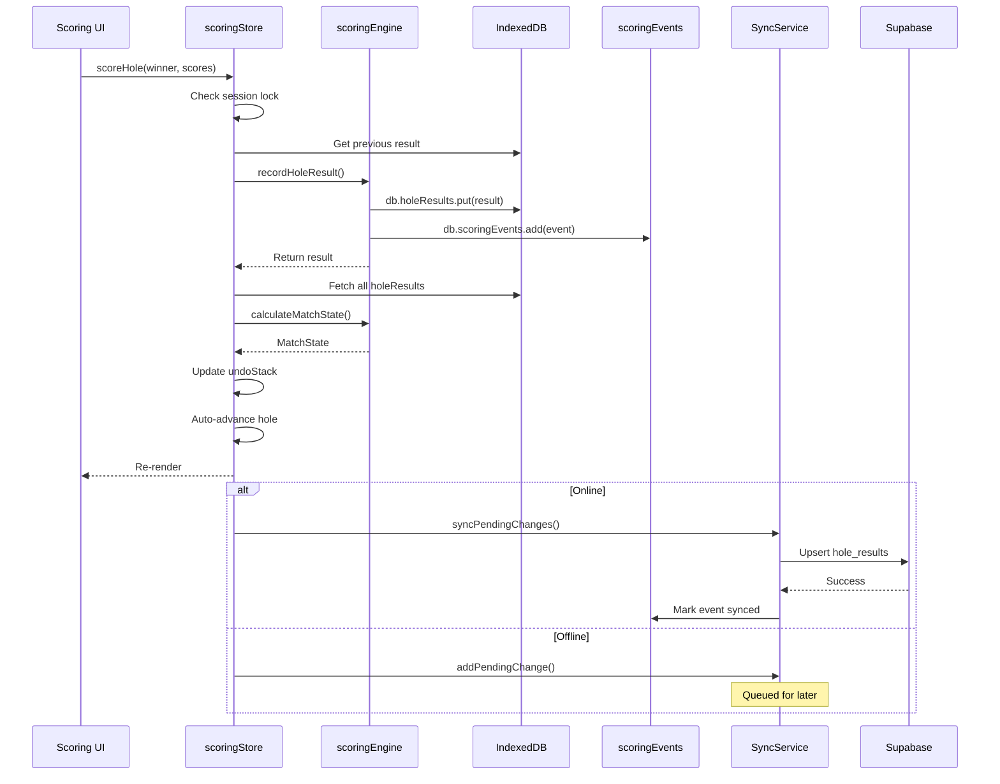

# Data Flow Architecture

**Golf Ryder Cup Web App**
*Comprehensive documentation of data flow patterns*

---

## Table of Contents

1. [State Management Architecture](#1-state-management-architecture)
2. [Offline-First Data Flow](#2-offline-first-data-flow)
3. [Scoring Data Flow (Critical Path)](#3-scoring-data-flow-critical-path)
4. [Authentication Flow](#4-authentication-flow)
5. [Real-time Updates](#5-real-time-updates)
6. [Component Data Dependencies](#6-component-data-dependencies)
7. [Diagrams](#7-diagrams)

---

## 1. State Management Architecture

### Overview

The app uses a **layered state architecture** combining:

- **Zustand Stores** — Client-side global state
- **Dexie (IndexedDB)** — Persistent offline-first storage
- **Supabase** — Cloud sync and real-time updates

```
┌─────────────────────────────────────────────────────────────┐
│                     React Components                        │
├─────────────────────────────────────────────────────────────┤
│                   Custom Hooks (useTripData, etc.)          │
├─────────────────────────────────────────────────────────────┤
│                     Zustand Stores                          │
│    ┌──────────┐ ┌──────────────┐ ┌────────┐ ┌──────────┐   │
│    │authStore │ │ scoringStore │ │tripStore│ │ uiStore  │   │
│    └──────────┘ └──────────────┘ └────────┘ └──────────┘   │
├─────────────────────────────────────────────────────────────┤
│              Dexie (IndexedDB) - Primary Storage            │
├─────────────────────────────────────────────────────────────┤
│              Supabase - Cloud Sync (Optional)               │
└─────────────────────────────────────────────────────────────┘
```

### Zustand Stores

#### 1. **tripStore** (`stores/tripStore.ts`)

Primary store for trip context. Manages:

| State | Description | Persistence |
|-------|-------------|-------------|
| `currentTrip` | Active trip object | LocalStorage (ID only) |
| `teams` | Team A (USA) & Team B (Europe) | Ephemeral (reloaded) |
| `teamMembers` | Player-team associations | Ephemeral |
| `players` | All players in trip | Ephemeral |
| `sessions` | Ryder Cup sessions | Ephemeral |
| `courses`, `teeSets` | Golf course data | Ephemeral |

**Persistence Strategy:**

```typescript
// Only the trip ID is persisted to localStorage
partialize: (state) => ({
    currentTripId: state.currentTrip?.id,
})
```

On app reload, `TripRehydrationProvider` detects the persisted ID and reloads full data from IndexedDB.

#### 2. **scoringStore** (`stores/scoringStore.ts`)

Manages active scoring sessions:

| State | Description | Persistence |
|-------|-------------|-------------|
| `activeMatch` | Currently selected match | Ephemeral |
| `activeMatchState` | Computed match status | Ephemeral (derived) |
| `sessionMatches` | All matches in session | Ephemeral |
| `matchStates` | Map of match ID → state | Ephemeral |
| `currentHole` | Hole being scored | Ephemeral |
| `undoStack` | Undo history | Ephemeral (rebuilt from events) |

**Key Pattern:** The `undoStack` is reconstructed from persisted `scoringEvents` when a match is selected, enabling undo across sessions.

#### 3. **authStore** (`stores/authStore.ts`)

Handles user authentication:

| State | Description | Persistence |
|-------|-------------|-------------|
| `currentUser` | User profile | LocalStorage |
| `isAuthenticated` | Auth status | LocalStorage |

**Persistence Strategy:**

```typescript
// Full user profile persisted
partialize: (state) => ({
    currentUser: state.currentUser,
    isAuthenticated: state.isAuthenticated,
})
```

User credentials (email + PIN) stored separately in `localStorage['golf-app-users']`.

#### 4. **uiStore** (`stores/uiStore.ts`)

UI state and preferences:

| State | Description | Persistence |
|-------|-------------|-------------|
| `activeTab` | Current navigation tab | LocalStorage |
| `theme` | 'light' / 'dark' / 'outdoor' | LocalStorage |
| `isCaptainMode` | Elevated permissions | LocalStorage |
| `toasts` | Notification queue | Ephemeral |
| `scoringPreferences` | UI scoring settings | LocalStorage |

### Store Interaction Pattern

Stores communicate through a **unidirectional pattern**:

```
User Action → Store Action → IndexedDB Write → State Update → UI Re-render
                                     ↓
                            Sync Queue (offline)
                                     ↓
                            Supabase (when online)
```

**Example: Loading a Trip**

```typescript
// 1. Component calls store action
useTripStore().loadTrip(tripId);

// 2. Store fetches from IndexedDB
const trip = await db.trips.get(tripId);
const teams = await db.teams.where('tripId').equals(tripId).toArray();
// ... load related data

// 3. State update triggers re-render
set({ currentTrip: trip, teams, players, sessions, ... });
```

### State Hydration on Page Load

```
┌─────────────────────────────────────────────────────────────┐
│                      App Startup                            │
└─────────────────────────────────────────────────────────────┘
                              │
                              ▼
┌─────────────────────────────────────────────────────────────┐
│  1. Zustand Persist Middleware                              │
│     - Reads localStorage['golf-trip-storage']               │
│     - Hydrates currentTripId                                │
└─────────────────────────────────────────────────────────────┘
                              │
                              ▼
┌─────────────────────────────────────────────────────────────┐
│  2. TripRehydrationProvider                                 │
│     - Detects persisted tripId                              │
│     - Calls loadTrip() to fetch full data from IndexedDB    │
└─────────────────────────────────────────────────────────────┘
                              │
                              ▼
┌─────────────────────────────────────────────────────────────┐
│  3. Auto-load User Trip (if authenticated)                  │
│     - Finds trips user belongs to                           │
│     - Loads active/upcoming trip automatically              │
└─────────────────────────────────────────────────────────────┘
```

---

## 2. Offline-First Data Flow

### IndexedDB Schema (Dexie)

The app uses **Dexie** as a wrapper around IndexedDB with typed tables:

```typescript
// Database Tables (db/index.ts)
class GolfTripDB extends Dexie {
    trips!: Table<Trip>;
    players!: Table<Player>;
    teams!: Table<Team>;
    teamMembers!: Table<TeamMember>;
    sessions!: Table<RyderCupSession>;
    matches!: Table<Match>;
    holeResults!: Table<HoleResult>;
    courses!: Table<Course>;
    teeSets!: Table<TeeSet>;
    scoringEvents!: Table<ScoringEvent>;  // Event log (append-only)
    syncMeta!: Table<SyncMetadata>;       // Sync tracking
    // ... additional tables
}
```

**Schema Indexes:**

```typescript
// Key indexes for efficient queries
trips: 'id, name, startDate'
matches: 'id, sessionId, status, [sessionId+matchOrder]'
holeResults: 'id, matchId, holeNumber, [matchId+holeNumber]'
scoringEvents: '++localId, id, matchId, timestamp, synced, [matchId+timestamp]'
```

### Offline Queue Mechanism

The `useOfflineQueue` hook manages actions queued while offline:

```typescript
interface QueuedAction {
    id: string;
    type: QueueActionType;  // 'score' | 'score-update' | 'match-finalize' | ...
    matchId?: string;
    data?: unknown;
    timestamp: string;
    retryCount: number;
    status: 'pending' | 'processing' | 'failed' | 'complete';
}
```

**Queue Flow:**

```
┌─────────────────────────────────────────────────────────────┐
│                    User Action                              │
└─────────────────────────────────────────────────────────────┘
                              │
                              ▼
                      ┌───────────────┐
                      │   Is Online?  │
                      └───────────────┘
                       /           \
                     Yes            No
                      │              │
                      ▼              ▼
         ┌────────────────┐  ┌────────────────────┐
         │ Direct Sync to │  │ Queue in localStorage│
         │   Supabase     │  │ queueStore.items[]   │
         └────────────────┘  └────────────────────┘
                                      │
                      ┌───────────────┴───────────────┐
                      │  When connection restored...   │
                      └───────────────┬───────────────┘
                                      ▼
         ┌────────────────────────────────────────────┐
         │           processQueue()                    │
         │  - For each pending action:                 │
         │    - Update status → 'processing'          │
         │    - Call syncAction()                     │
         │    - On success: remove from queue         │
         │    - On failure: retry (max 3x)            │
         └────────────────────────────────────────────┘
```

**Queue Persistence:**

```typescript
// Queue persisted to localStorage
localStorage.setItem('offline_queue', JSON.stringify(items));
```

### Sync Service Architecture

The `SyncService` class handles bidirectional sync with Supabase:

```typescript
class SyncService {
    private pendingChanges: PendingChange[];

    // Add change for later sync
    addPendingChange(table, operation, data) { ... }

    // Sync all pending to cloud
    async syncPendingChanges(): Promise<SyncResult> { ... }

    // Full trip sync
    async syncTripToCloud(tripId: string) { ... }

    // Fetch updates from cloud
    async pullTripFromCloud(tripId: string) { ... }
}
```

### Conflict Resolution Strategy

The app uses **Last-Write-Wins (LWW)** with event sourcing for audit:

1. **Timestamp-based Resolution:** Later `timestamp` wins
2. **Event Log Preservation:** All changes recorded in `scoringEvents` table
3. **Captain Override Flag:** Admin changes marked with `isCaptainOverride: true`

```typescript
interface HoleResult {
    // ... fields
    timestamp: ISODateString;        // Original creation time
    lastEditedAt?: ISODateString;    // Last modification
    lastEditedBy?: string;           // Who made last edit
    editHistory?: HoleResultEdit[];  // Full audit trail
}
```

---

## 3. Scoring Data Flow (Critical Path)

### Score Entry Flow

```
┌─────────────────────────────────────────────────────────────┐
│                    Scoring UI                               │
│  (HoleScorePanel / QuickScoreModal)                         │
└─────────────────────────────────────────────────────────────┘
                              │
                              │ User taps winner: "Team A"
                              ▼
┌─────────────────────────────────────────────────────────────┐
│              scoringStore.scoreHole()                       │
│  1. Check if session is locked                              │
│  2. Get previous result (for undo)                          │
│  3. Call scoringEngine.recordHoleResult()                   │
└─────────────────────────────────────────────────────────────┘
                              │
                              ▼
┌─────────────────────────────────────────────────────────────┐
│           scoringEngine.recordHoleResult()                  │
│  1. Check for existing result (edit vs new)                 │
│  2. Build edit history if editing                           │
│  3. Create/update HoleResult in IndexedDB                   │
│  4. Create ScoringEvent for audit/undo                      │
└─────────────────────────────────────────────────────────────┘
                              │
              ┌───────────────┴───────────────┐
              │                               │
              ▼                               ▼
┌─────────────────────┐         ┌─────────────────────────────┐
│   db.holeResults    │         │      db.scoringEvents       │
│   .put(result)      │         │      .add(event)            │
│                     │         │  (append-only log)          │
└─────────────────────┘         └─────────────────────────────┘
                              │
                              ▼
┌─────────────────────────────────────────────────────────────┐
│        scoringStore: Refresh Match State                    │
│  1. Fetch all holeResults for match                         │
│  2. Call calculateMatchState() to derive state              │
│  3. Update matchStates map                                  │
│  4. Push to undoStack                                       │
│  5. Auto-advance currentHole (if not closed out)            │
└─────────────────────────────────────────────────────────────┘
                              │
                              ▼
┌─────────────────────────────────────────────────────────────┐
│              UI Re-renders with new state                   │
└─────────────────────────────────────────────────────────────┘
```

### Event Sourcing Pattern

All scoring actions are recorded as immutable events:

```typescript
// Event types (types/events.ts)
enum ScoringEventType {
    HoleScored = 'hole_scored',
    HoleEdited = 'hole_edited',
    HoleUndone = 'hole_undone',
    MatchStarted = 'match_started',
    MatchFinalized = 'match_finalized',
    MatchCancelled = 'match_cancelled',
}

interface ScoringEvent {
    localId?: number;              // Auto-increment for local ordering
    id: UUID;                      // Global UUID for sync
    matchId: UUID;                 // Parent match
    eventType: ScoringEventType;
    timestamp: ISODateString;
    actorName: string;             // Who made the change
    payload: ScoringEventPayload;  // Event-specific data
    synced: boolean;               // Sync status (Phase 2)
}
```

**Event Payloads:**

```typescript
// Hole scored
{ type: 'hole_scored', holeNumber: 5, winner: 'teamA', teamAStrokes: 4, teamBStrokes: 5 }

// Hole edited
{ type: 'hole_edited', holeNumber: 5, previousWinner: 'teamA', newWinner: 'teamB', ... }

// Hole undone
{ type: 'hole_undone', holeNumber: 5, previousWinner: 'teamA', ... }
```

### Match State Derivation

Match state is computed (not stored) from hole results:

```typescript
// scoringEngine.calculateMatchState()
function calculateMatchState(match: Match, holeResults: HoleResult[]): MatchState {
    // Count holes won by each team
    let teamAHolesWon = 0, teamBHolesWon = 0, holesPlayed = 0;

    for (const result of sortedResults) {
        if (result.winner === 'teamA') teamAHolesWon++;
        else if (result.winner === 'teamB') teamBHolesWon++;
        if (result.winner !== 'none') holesPlayed++;
    }

    const currentScore = teamAHolesWon - teamBHolesWon;
    const holesRemaining = 18 - holesPlayed;

    // Dormie: ahead by exactly holes remaining
    const isDormie = Math.abs(currentScore) === holesRemaining && currentScore !== 0;

    // Closed out: lead greater than holes remaining
    const isClosedOut = Math.abs(currentScore) > holesRemaining;

    return {
        currentScore,
        teamAHolesWon,
        teamBHolesWon,
        holesPlayed,
        holesRemaining,
        isDormie,
        isClosedOut,
        displayScore: formatMatchScore(currentScore, holesRemaining, isClosedOut, holesPlayed),
        winningTeam: determineWinningTeam(currentScore, holesPlayed, holesRemaining),
        // ...
    };
}
```

### Cross-Device Score Sync

```
┌─────────────────────────────────────────────────────────────┐
│                      Device A                               │
│                 (Scorer on course)                          │
└─────────────────────────────────────────────────────────────┘
                              │
                              │ Score entered
                              ▼
         ┌────────────────────────────────────────────┐
         │  1. Write to local IndexedDB               │
         │  2. Create ScoringEvent (synced: false)    │
         │  3. Trigger sync if online                 │
         └────────────────────────────────────────────┘
                              │
                              ▼
         ┌────────────────────────────────────────────┐
         │           Supabase Real-time              │
         │  - Upsert to hole_results table           │
         │  - Broadcast to channel `trip:{tripId}`   │
         └────────────────────────────────────────────┘
                              │
                              ▼
┌─────────────────────────────────────────────────────────────┐
│                      Device B                               │
│              (Spectator in clubhouse)                       │
└─────────────────────────────────────────────────────────────┘
                              │
                              │ Subscription receives update
                              ▼
         ┌────────────────────────────────────────────┐
         │  useRealtime hook handlers:                │
         │  - handleHoleResultUpdate()               │
         │    - Update local IndexedDB               │
         │    - Call refreshMatchState()             │
         │    - UI re-renders automatically          │
         └────────────────────────────────────────────┘
```

---

## 4. Authentication Flow

### Optional Auth Pattern

The app uses an **optional authentication** model:

- Users must create a profile (name, handicap) to use the app
- No email verification required
- Simple PIN-based login (not OAuth)
- Profile stored locally with cloud backup option

### Session Management

```typescript
// authStore state
interface AuthState {
    currentUser: UserProfile | null;
    isAuthenticated: boolean;
    isLoading: boolean;
}

// UserProfile extends Player with additional fields
interface UserProfile extends Player {
    isProfileComplete: boolean;
    phoneNumber?: string;
    preferredTees?: 'back' | 'middle' | 'forward';
    shirtSize?: 'XS' | 'S' | 'M' | 'L' | 'XL' | '2XL' | '3XL';
    // ...
}
```

### Profile Creation Flow

```
┌─────────────────────────────────────────────────────────────┐
│                   First-time User                           │
│              Opens app, no profile                          │
└─────────────────────────────────────────────────────────────┘
                              │
                              ▼
┌─────────────────────────────────────────────────────────────┐
│                     AuthGuard                               │
│  - Checks isAuthenticated from Zustand                      │
│  - Not authenticated → redirect to /profile/create          │
└─────────────────────────────────────────────────────────────┘
                              │
                              ▼
┌─────────────────────────────────────────────────────────────┐
│              /profile/create Page                           │
│  - User enters: firstName, lastName, email, handicap        │
│  - Calls authStore.createProfile()                          │
└─────────────────────────────────────────────────────────────┘
                              │
                              ▼
┌─────────────────────────────────────────────────────────────┐
│             authStore.createProfile()                       │
│  1. Generate UUID and 4-digit PIN                           │
│  2. Create UserProfile object                               │
│  3. Save to localStorage['golf-app-users']                  │
│  4. Add to IndexedDB players table                          │
│  5. Set state: isAuthenticated = true                       │
│  6. Show PIN to user (must save for future login)           │
└─────────────────────────────────────────────────────────────┘
                              │
                              ▼
┌─────────────────────────────────────────────────────────────┐
│              Redirect to main app                           │
│             AuthGuard allows access                         │
└─────────────────────────────────────────────────────────────┘
```

### Login Flow (Returning User)

```
┌─────────────────────────────────────────────────────────────┐
│                    /login Page                              │
│          User enters email + PIN                            │
└─────────────────────────────────────────────────────────────┘
                              │
                              ▼
┌─────────────────────────────────────────────────────────────┐
│              authStore.login(email, pin)                    │
│  1. Load users from localStorage['golf-app-users']          │
│  2. Find user by email (case-insensitive)                   │
│  3. Verify PIN matches                                      │
│  4. Set currentUser and isAuthenticated = true              │
└─────────────────────────────────────────────────────────────┘
```

### Protected Routes

The `AuthGuard` component wraps the app and enforces authentication:

```typescript
const PUBLIC_ROUTES = [
    '/profile/create',
    '/login',
    '/join',  // Trip invitations
];

// If not authenticated and not on public route → redirect to /profile/create
```

---

## 5. Real-time Updates

### Supabase Subscriptions

The app uses Supabase Realtime for live updates:

```typescript
// useRealtime.ts - Subscribe to trip channel
function subscribeTripChannel(tripId: string, handlers: {
    onMatchUpdate?: (payload) => void;
    onHoleResultUpdate?: (payload) => void;
    onSessionUpdate?: (payload) => void;
    onPresenceSync?: (state) => void;
}) {
    return supabase
        .channel(`trip:${tripId}`)
        .on('presence', { event: 'sync' }, handlePresence)
        .on('postgres_changes', {
            event: '*',
            schema: 'public',
            table: 'matches',
            filter: `session_id=in.(${sessionIds})`
        }, handlers.onMatchUpdate)
        .on('postgres_changes', {
            event: '*',
            schema: 'public',
            table: 'hole_results',
        }, handlers.onHoleResultUpdate)
        .subscribe();
}
```

### Optimistic Updates

The `useOptimistic` hook provides instant UI feedback:

```typescript
interface PendingOperation {
    id: string;
    type: 'create' | 'update' | 'delete';
    table: string;
    data: T;
    previousData?: T;      // For rollback
    timestamp: number;
    retryCount: number;
    status: 'pending' | 'syncing' | 'failed' | 'completed';
}
```

**Optimistic Update Flow:**

```
1. User action (e.g., score a hole)
2. Immediately update local state (optimistic)
3. Queue sync operation
4. On sync success: mark complete
5. On sync failure: rollback to previousData
```

### Event Broadcasting

Components can broadcast custom events:

```typescript
// Live update types (useLiveUpdates.ts)
type LiveUpdateType =
    | 'score_update'
    | 'match_complete'
    | 'match_started'
    | 'player_joined'
    | 'chat_message'
    | 'achievement'
    | 'standings_change';
```

---

## 6. Component Data Dependencies

### Hook → Component Mapping

| Hook | Primary Data | Consumer Components |
|------|--------------|---------------------|
| `useTripStore()` | Trip, teams, players, sessions | `DaySummaryCard`, `CartTracker`, `MatchPredictions`, `QuickScoreFAB` |
| `useScoringStore()` | Active match, hole results, undo stack | `HoleScorePanel`, `MatchScorecard`, `QuickScoreModal` |
| `useAuthStore()` | Current user, auth status | `AuthGuard`, `TripRehydrationProvider`, `ProfilePage` |
| `useUIStore()` | Theme, toasts, captain mode | `ThemeProvider`, `ToastContainer`, all components |
| `useMatchState(matchId)` | Live match state (derived) | `MatchCard`, `LiveMatchView` |
| `useTripData(tripId)` | Full trip with computed standings | `StandingsPage`, `TripOverview` |
| `useMatchScoring(matchId)` | Scoring UI state, actions | `ScoringPage`, `HoleScorePanel` |
| `useLiveUpdates()` | Real-time event stream | `LiveFeed`, `NotificationBanner` |
| `useOfflineQueue()` | Pending sync operations | `OfflineIndicator`, `SyncStatus` |
| `useRealtime(tripId)` | Connection status, active users | `ActiveUsersPanel`, `ConnectionIndicator` |

### Data Transformation Pipeline

```
┌──────────────────────────────────────────────────────────────────────┐
│                          RAW DATA                                    │
│  (IndexedDB Tables)                                                  │
│  - trips, players, matches, holeResults, scoringEvents               │
└──────────────────────────────────────────────────────────────────────┘
                                    │
                                    ▼
┌──────────────────────────────────────────────────────────────────────┐
│                       COMPUTED DATA                                  │
│  (Scoring Engine + Hooks)                                            │
│  - MatchState from holeResults                                       │
│  - TeamStandings from all match results                              │
│  - PlayerStats from match history                                    │
└──────────────────────────────────────────────────────────────────────┘
                                    │
                                    ▼
┌──────────────────────────────────────────────────────────────────────┐
│                         VIEW DATA                                    │
│  (Component Props)                                                   │
│  - displayScore: "2 UP" / "3&2" / "AS"                               │
│  - formattedStandings: "USA 10 - EUR 6"                              │
│  - matchStatusText: "Team USA leads, 2 UP through 14"                │
└──────────────────────────────────────────────────────────────────────┘
```

### Computed Types (types/computed.ts)

```typescript
// MatchState - derived from hole results
interface MatchState {
    match: Match;
    holeResults: HoleResult[];
    currentScore: number;        // +N = Team A leads, -N = Team B leads
    teamAHolesWon: number;
    teamBHolesWon: number;
    holesPlayed: number;
    holesRemaining: number;
    isDormie: boolean;
    isClosedOut: boolean;
    status: MatchStatus;
    displayScore: string;        // "2 UP", "3&2", "AS"
    winningTeam: 'teamA' | 'teamB' | 'halved' | null;
}

// TeamStandings - aggregated from all matches
interface TeamStandings {
    teamAPoints: number;
    teamBPoints: number;
    matchesCompleted: number;
    totalMatches: number;
    leader: 'teamA' | 'teamB' | null;
    margin: number;
}
```

---

## 7. Diagrams

### High-Level Data Flow

```
┌─────────────────────────────────────────────────────────────────────────────┐
│                              GOLF RYDER CUP APP                             │
│                           High-Level Data Flow                              │
└─────────────────────────────────────────────────────────────────────────────┘

    ┌─────────────────────────────────────────────────────────────────────┐
    │                         PRESENTATION LAYER                          │
    │                                                                     │
    │   ┌─────────────┐ ┌─────────────┐ ┌─────────────┐ ┌─────────────┐  │
    │   │  Scoring    │ │  Standings  │ │  Live Feed  │ │  Settings   │  │
    │   │  Components │ │  Components │ │  Components │ │  Components │  │
    │   └──────┬──────┘ └──────┬──────┘ └──────┬──────┘ └──────┬──────┘  │
    └──────────┼───────────────┼───────────────┼───────────────┼──────────┘
               │               │               │               │
               ▼               ▼               ▼               ▼
    ┌─────────────────────────────────────────────────────────────────────┐
    │                           HOOKS LAYER                               │
    │                                                                     │
    │   ┌─────────────┐ ┌─────────────┐ ┌─────────────┐ ┌─────────────┐  │
    │   │useMatch     │ │useTripData  │ │useLive      │ │useOnline    │  │
    │   │Scoring      │ │             │ │Updates      │ │Status       │  │
    │   └──────┬──────┘ └──────┬──────┘ └──────┬──────┘ └──────┬──────┘  │
    └──────────┼───────────────┼───────────────┼───────────────┼──────────┘
               │               │               │               │
               ▼               ▼               ▼               ▼
    ┌─────────────────────────────────────────────────────────────────────┐
    │                         STATE LAYER (Zustand)                       │
    │                                                                     │
    │   ┌─────────────┐ ┌─────────────┐ ┌─────────────┐ ┌─────────────┐  │
    │   │scoringStore │ │ tripStore   │ │ authStore   │ │  uiStore    │  │
    │   └──────┬──────┘ └──────┬──────┘ └──────┬──────┘ └──────┬──────┘  │
    └──────────┼───────────────┼───────────────┼───────────────┼──────────┘
               │               │               │               │
               └───────────────┴───────────────┴───────────────┘
                                       │
                                       ▼
    ┌─────────────────────────────────────────────────────────────────────┐
    │                     PERSISTENCE LAYER (Dexie/IndexedDB)             │
    │                                                                     │
    │   ┌─────────┐ ┌─────────┐ ┌──────────┐ ┌──────────┐ ┌───────────┐  │
    │   │  trips  │ │ players │ │ matches  │ │holeResults│ │scoringEvts│  │
    │   └─────────┘ └─────────┘ └──────────┘ └──────────┘ └───────────┘  │
    └─────────────────────────────────┬───────────────────────────────────┘
                                      │
                          ┌───────────┴───────────┐
                          │                       │
                          ▼                       ▼
    ┌─────────────────────────────────┐ ┌─────────────────────────────────┐
    │        SYNC SERVICE             │ │      REALTIME SERVICE           │
    │   (syncService.ts)              │ │   (useRealtime.ts)              │
    │   - Push pending changes        │ │   - Subscribe to channels       │
    │   - Pull cloud updates          │ │   - Receive live updates        │
    └─────────────────┬───────────────┘ └─────────────────┬───────────────┘
                      │                                   │
                      └───────────────┬───────────────────┘
                                      │
                                      ▼
    ┌─────────────────────────────────────────────────────────────────────┐
    │                       SUPABASE (Cloud)                              │
    │                                                                     │
    │   ┌──────────────────────────────────────────────────────────────┐ │
    │   │  PostgreSQL Tables + Realtime Subscriptions + Row-Level Sec  │ │
    │   └──────────────────────────────────────────────────────────────┘ │
    └─────────────────────────────────────────────────────────────────────┘
```

### Scoring Pipeline Diagram



### Sync Mechanism Diagram

```
┌─────────────────────────────────────────────────────────────────────────────┐
│                         OFFLINE-FIRST SYNC ARCHITECTURE                     │
└─────────────────────────────────────────────────────────────────────────────┘

                               ONLINE STATE
┌───────────────────────────────────────────────────────────────────────────┐
│                                                                           │
│   User Action ──► Local DB ──► Sync Service ──► Supabase ──► Broadcast   │
│                                                              │            │
│                                                              ▼            │
│                                                       Other Devices       │
│                                                                           │
└───────────────────────────────────────────────────────────────────────────┘

                              OFFLINE STATE
┌───────────────────────────────────────────────────────────────────────────┐
│                                                                           │
│   User Action ──► Local DB ──► Offline Queue (localStorage)              │
│                       │                 │                                 │
│                       ▼                 │                                 │
│                  UI Updates             │                                 │
│                  (Immediate)            │                                 │
│                                         │                                 │
│                     ┌───────────────────┴───────────────────┐            │
│                     │        CONNECTION RESTORED             │            │
│                     └───────────────────┬───────────────────┘            │
│                                         │                                 │
│                                         ▼                                 │
│                              ┌──────────────────────┐                    │
│                              │   processQueue()     │                    │
│                              │   - Retry logic      │                    │
│                              │   - Conflict detect  │                    │
│                              │   - Sync to cloud    │                    │
│                              └──────────────────────┘                    │
│                                                                           │
└───────────────────────────────────────────────────────────────────────────┘

                           CONFLICT RESOLUTION
┌───────────────────────────────────────────────────────────────────────────┐
│                                                                           │
│   1. Detect: Compare timestamps                                          │
│   2. Resolve: Last-Write-Wins (LWW)                                      │
│   3. Audit: All changes logged in scoringEvents                          │
│   4. Override: Captain flag preserves admin intent                       │
│                                                                           │
│   ┌─────────────────────────────────────────────────────────────────┐    │
│   │  Device A (t=10:00)  │  Device B (t=10:01)  │  Resolution      │    │
│   │  Hole 5: Team A      │  Hole 5: Team B      │  → Team B wins   │    │
│   │                      │                      │  (later timestamp)│    │
│   └─────────────────────────────────────────────────────────────────┘    │
│                                                                           │
└───────────────────────────────────────────────────────────────────────────┘
```

### State Hydration Diagram

```
                        APP STARTUP SEQUENCE
    ┌────────────────────────────────────────────────────────────┐
    │                                                            │
    │  t=0   Browser loads React app                             │
    │         │                                                  │
    │         ▼                                                  │
    │  t=1   Zustand stores initialize                           │
    │         │  - authStore reads localStorage                  │
    │         │  - tripStore reads localStorage (ID only)        │
    │         │  - uiStore reads localStorage                    │
    │         ▼                                                  │
    │  t=2   TripRehydrationProvider mounts                      │
    │         │  - Detects persisted tripId                      │
    │         │  - Waits 50ms for hydration                      │
    │         ▼                                                  │
    │  t=3   loadTrip(persistedTripId) called                    │
    │         │  - Fetches from IndexedDB                        │
    │         │  - Populates Zustand state                       │
    │         ▼                                                  │
    │  t=4   AuthGuard checks authentication                     │
    │         │  - If authenticated: render children             │
    │         │  - If not: redirect to /profile/create           │
    │         ▼                                                  │
    │  t=5   App ready, UI renders with data                     │
    │                                                            │
    └────────────────────────────────────────────────────────────┘
```

---

## Summary

The Golf Ryder Cup App implements a **robust offline-first architecture** with:

1. **Layered State Management** — Zustand for UI state, IndexedDB for persistence, Supabase for sync
2. **Event Sourcing** — All scoring actions are immutable events enabling undo and audit
3. **Optimistic Updates** — Immediate UI feedback with automatic rollback on sync failure
4. **Computed State** — Match state derived from raw hole results, never stored directly
5. **Progressive Sync** — Works offline, syncs when online, resolves conflicts via LWW

The critical scoring path is designed for reliability on the golf course where connectivity is often intermittent.
